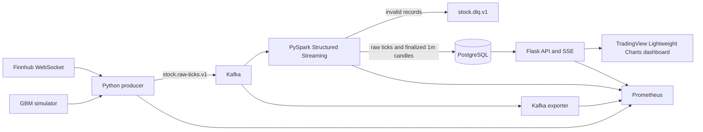
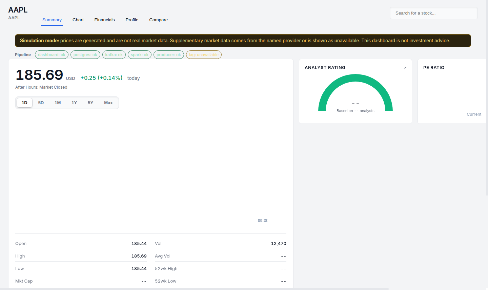

# Real-Time Stock Data Pipeline

A reproducible portfolio project that converts live or generated market ticks into
event-time, one-minute OHLCV candles and serves them through a Flask dashboard.
The default setup is a single-machine Docker Compose environment intended for
development and demonstration—not a production trading system.

## What is implemented

- Explicit `simulation` and `live` ingestion modes.
- Finnhub WebSocket ingestion in live mode.
- Geometric Brownian Motion tick generation in simulation mode.
- Kafka topics partitioned by stock symbol.
- PySpark Structured Streaming validation and dead-letter routing.
- Deterministic event-time open and close prices.
- Finalized one-minute OHLCV and VWAP aggregation.
- Idempotent raw-tick inserts using the producer's event ID.
- PostgreSQL migrations managed by Flyway.
- Flask APIs, Server-Sent Events, and a browser dashboard.
- Prometheus service metrics and Kafka exporter metrics.
- Unit, Spark transformation, API, and optional end-to-end tests.

There is no stock-price prediction model in this repository.

## Architecture



The local Kafka broker uses replication factor 1 and Spark defaults to `local[2]`.
Those choices keep the demo affordable; they do not provide production fault tolerance.

## Verified dashboard



This screenshot is captured automatically after the end-to-end workflow sends ticks
through Kafka, finalizes a one-minute candle in Spark, verifies it in PostgreSQL, and
loads the Flask dashboard. The yellow disclosure is intentional: generated prices are
always identified as simulation data.

## Quick start

Requirements:

- Docker with Compose v2
- Approximately 8 GB of available memory

```bash
cp .env.example .env
make up
make status
```

Open:

- Dashboard: <http://localhost:5000>
- Health: <http://localhost:5000/api/health>
- Prometheus: <http://localhost:9090>
- Producer metrics: <http://localhost:9101>
- Spark metrics: <http://localhost:9102>
- Kafka exporter: <http://localhost:9308/metrics>

Stop the stack with `make down`.

### Data modes

Simulation is the safe default:

```dotenv
DATA_MODE=simulation
```

The dashboard displays a persistent simulation disclosure. To use live Finnhub
ticks, set both values and restart the stack:

```dotenv
DATA_MODE=live
FINNHUB_API_KEY=replace-with-your-key
```

The process fails at startup if live mode is selected without a key. Provider
failures never silently become invented market data: responses name their
`data_source`, and unavailable provider datasets return HTTP 503.

## Correctness guarantees

- Kafka messages are keyed by symbol to preserve per-symbol partition ordering.
- Every raw event carries a UUID used as the PostgreSQL primary key.
- Replaying a raw event is safe because duplicate event IDs are ignored.
- A fresh deployment reads retained Kafka data from the earliest offset, then resumes
  from Spark checkpoints, so ticks published during startup are not silently skipped.
- Candles use one-minute event-time windows and a 30-second watermark.
- Open and close use the earliest and latest `(timestamp, event_id)` values.
- Append mode emits a candle only after its window is finalized.
- Candle upserts replace the finalized aggregate, so retries cannot add volume twice.
- Invalid prices, timestamps, symbols, IDs, or negative volumes go to the DLQ.

## Development and verification

```bash
python -m venv .venv
# Windows: .venv\Scripts\activate
# macOS/Linux: source .venv/bin/activate

pip install -r requirements-dev.txt
pip install -r producer/requirements.txt
pip install -r spark_processor/requirements.txt
pip install -r dashboard/requirements.txt

make lint
make test
make validate
```

The regular CI workflow runs linting, unit/Spark/API tests, Compose validation,
and builds all three application containers. A manually triggered integration
workflow starts the complete stack, publishes known ticks, and verifies the
finalized PostgreSQL candle.

## Observability and benchmarks

Prometheus scrapes producer, Spark, Flask, and Kafka exporter metrics. The dashboard
shows service status and aggregate consumer lag. The included
load-test script reports throughput and p50/p95/p99 HTTP latency without adding a
benchmark dependency:

```bash
python benchmarks/run_dashboard_load.py \
  --url http://localhost:5000/api/candles/AAPL?limit=200 \
  --requests 1000 --concurrency 25
```

See [benchmarks/README.md](benchmarks/README.md) for the required methodology.
No throughput or latency result is claimed until it has been measured and recorded.

## Repository map

```text
producer/             Finnhub and simulated Kafka producer
spark_processor/      Validation, DLQ, OHLCV aggregation, PostgreSQL writers
db/migrations/        Versioned Flyway database migrations
dashboard/            Flask API, SSE stream, and browser interface
observability/        Prometheus scrape configuration
tests/                Unit, Spark, API, and optional full-stack tests
benchmarks/            Reproducible dashboard load test
```

## Limitations

- The default environment has one Kafka broker and one local Spark process.
- A finalized one-minute candle appears after the watermark, not with sub-second latency.
- PostgreSQL writes currently collect each small finalized micro-batch on the Spark driver.
- The dashboard is a demonstration interface, not a trading terminal.
- Finnhub, Yahoo Finance, and other upstream services have their own limits and terms.
- Provider-backed history, company data, and financial statements require outbound network access.
- There is no authentication, authorization, TLS termination, or multi-tenant isolation.
- Public deployment requires secret management, network policies, backups, and capacity testing.

## Release checklist

- CI and the manual end-to-end workflow are green.
- A reproducible benchmark report is attached to the release.
- Dashboard screenshots or a short demo video are added under `docs/`.
- GitHub repository name, About text, and topics match [docs/GITHUB_SETTINGS.md](docs/GITHUB_SETTINGS.md).
- The verified commit is tagged `v1.0.0`.
